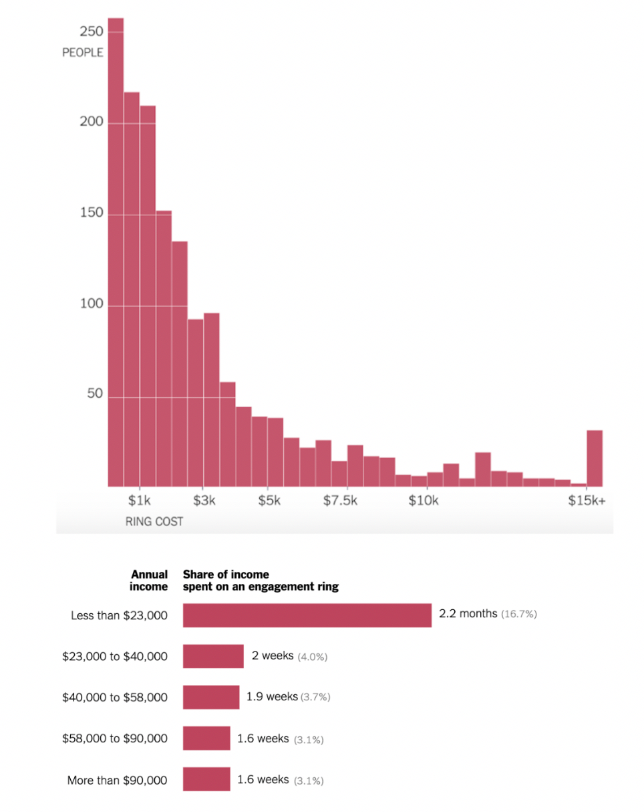
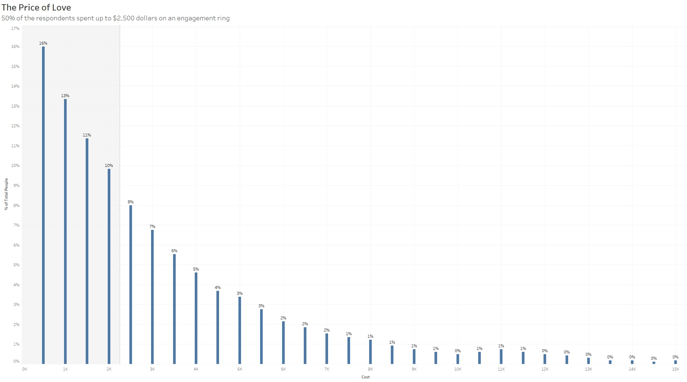
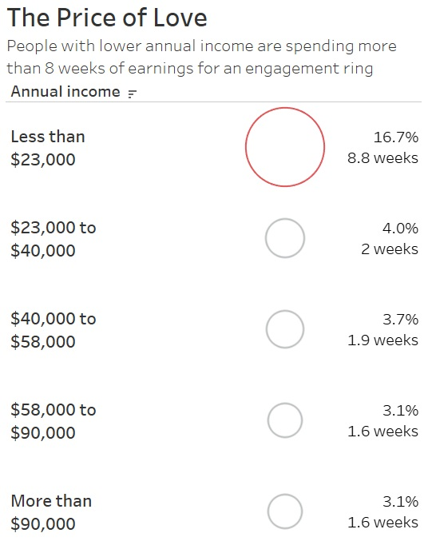

| [home page](https://h-calderon.github.io/portfolio/) | [visualizing government debt](visualizing-government-debt.md) | [critique by design](critique-by-design.md) |

# Critique by Design
## Original Design

This is a simple bar chart graph, comparing the national gross debt of each country in the year 2021, sorted from highest to lowest. The colored bars highlight the debt to GDP ratio of the average country and the ratio of the organization (OECD) as a whole.

> Source: <a href="https://www.nytimes.com/2020/02/06/learning/whats-going-on-in-this-graph-engagement-ring-costs.html">New York Times, 2020</a>

## Sketches

# Final Result

## Graph 1

<noscript></noscript><object class='tableauViz'  style='display:none;'><param name='host_url' value='https%3A%2F%2Fpublic.tableau.com%2F' /> <param name='embed_code_version' value='3' /> <param name='site_root' value='' /><param name='name' value='PriceEngagementRing&#47;ThePriceofLove' /><param name='tabs' value='no' /><param name='toolbar' value='yes' /><param name='static_image' value='https:&#47;&#47;public.tableau.com&#47;static&#47;images&#47;Pr&#47;PriceEngagementRing&#47;ThePriceofLove&#47;1.png' /> <param name='animate_transition' value='yes' /><param name='display_static_image' value='yes' /><param name='display_spinner' value='yes' /><param name='display_overlay' value='yes' /><param name='display_count' value='yes' /><param name='language' value='en-US' /></object>
                

## Graph 2

<noscript></noscript><object class='tableauViz'  style='display:none;'><param name='host_url' value='https%3A%2F%2Fpublic.tableau.com%2F' /> <param name='embed_code_version' value='3' /> <param name='site_root' value='' /><param name='name' value='WeeksSalaryforanEngagementRing&#47;3MonthsSalaryforaRing' /><param name='tabs' value='no' /><param name='toolbar' value='yes' /><param name='static_image' value='https:&#47;&#47;public.tableau.com&#47;static&#47;images&#47;We&#47;WeeksSalaryforanEngagementRing&#47;3MonthsSalaryforaRing&#47;1.png' /> <param name='animate_transition' value='yes' /><param name='display_static_image' value='yes' /><param name='display_spinner' value='yes' /><param name='display_overlay' value='yes' /><param name='display_count' value='yes' /><param name='language' value='en-US' /></object>
                

  
