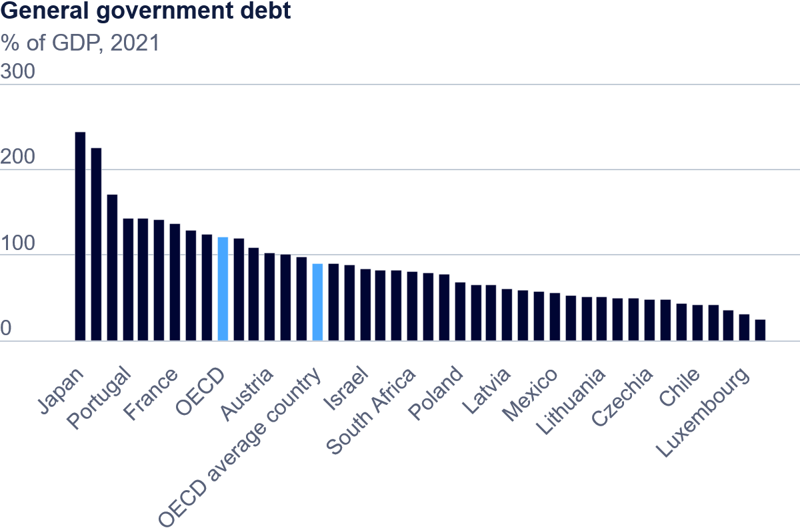

# Test
## Bar Chart

This is a simple bar chart graph, comparing the national gross debt of each country in the year 2021, sorted from highest to lowest. The colored bars highlight the debt to GDP ratio of the average country and the ratio of the organization (OECD) as a whole.

> Source: <a href="https://www.oecd.org/en/data/indicators/general-government-debt.html?oecdcontrol-3122613a85-var3=2021">Organisation for Economic Co-operation and Development</a>

## Heat Map
