| [home page](https://h-calderon.github.io/portfolio/) | [visualizing government debt](visualizing-government-debt.md) | [critique by design](critique-by-design.md) | [final project part 1](final-project-part-1.md) | [final project part 2](final-project-part-2.md) |

# Wireframes / storyboards

The general storyline goes something like this:

## The Gaming Industry of Today

Show how it's an industry that keeps growing every 

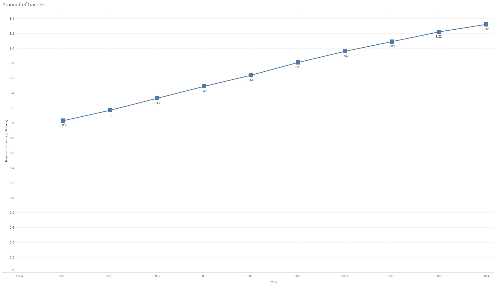

What kind of games are popular?

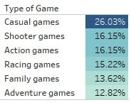

## Who is playing ?

Who is the target audience for games ?

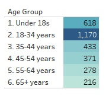

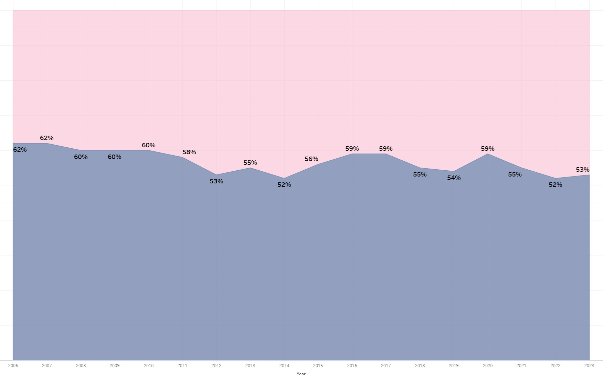

Why do people enjoy playing?

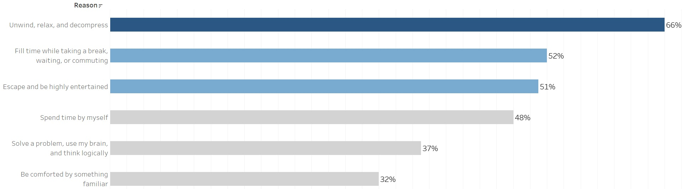

## High Revenue = High Interest

Which countries are the highest earners in this industry?

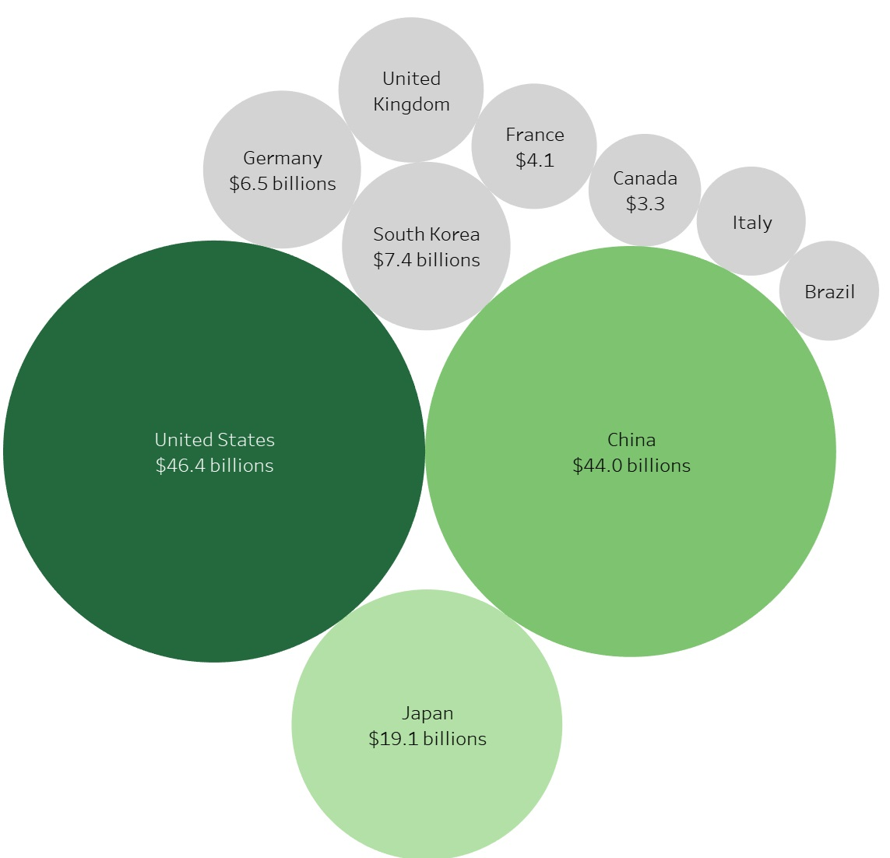

How do they make money?

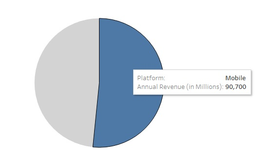

## Why do people spend their money on these mechanics?

These are the general motivations

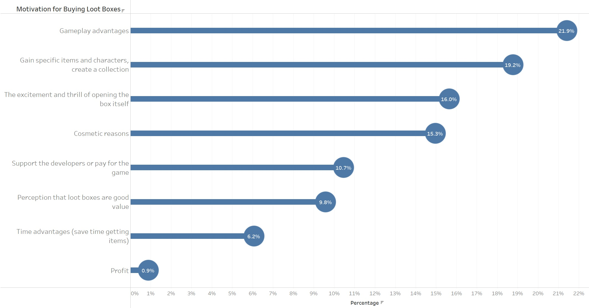

## What does this spending look like ?

How much do they spend per day ?

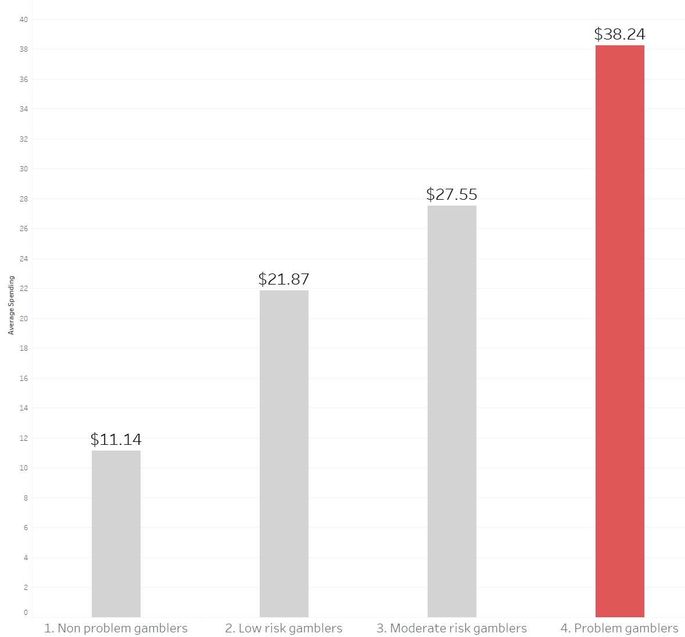

How much do they spend per week ?

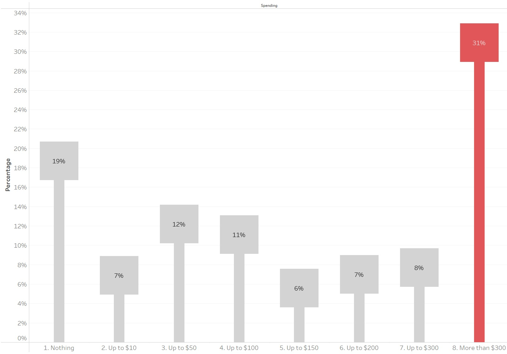

## What can we do ?

What can be done ?

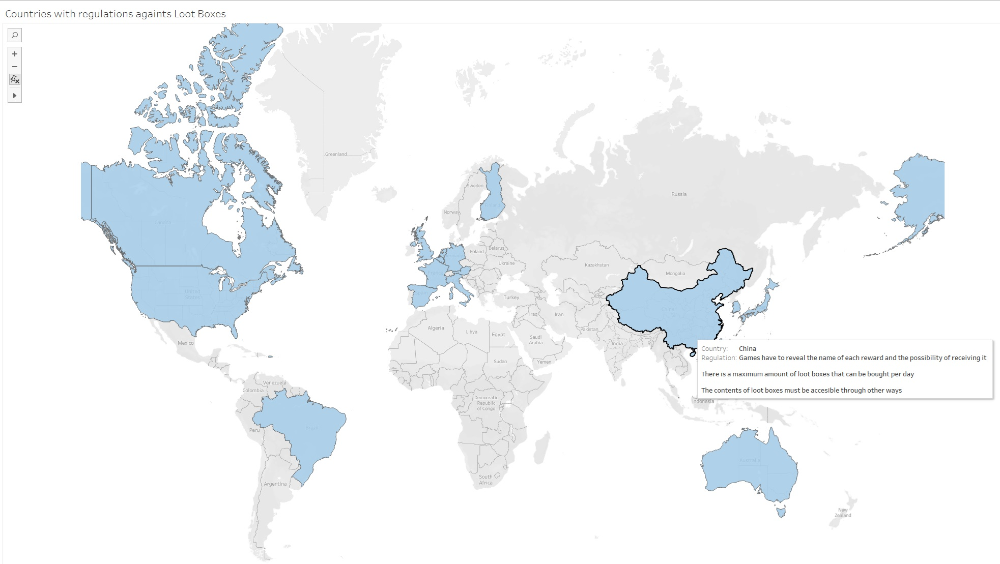

# User research 

## Target audience

My target audience here is people who enjoy playing videogames, who are at risk of falling prey to these predatory practices.

## Interview script

| Goal                              | Questions to Ask                                            |
|-----------------------------------|-------------------------------------------------------------|
|Make the graphs easy to understand |Do you have any questions or comments about what you've seen?|
|The storyline should be cohesive   |Would you change the order of the topics?                    |
|All the required parts are included|Is there anything you'd add or remove?                       |

## Interview findings

| Questions                                                   | Male, 31, Biologist                                                                     | Female, 28, Graphical Designer                                                                     | Male, 33, Programmer                                                           |
|-------------------------------------------------------------|-----------------------------------------------------------------------------------------|----------------------------------------------------------------------------------------------------|--------------------------------------------------------------------------------|
|Do you have any questions or comments about what you've seen?|It's simple to understand                                                                |I feel like this would benefit from more text                                                       |Most of it are things I imagined, but it's interesting to have a confirmation   |
|Would you change the order of the topics?                    |Maybe add some definitions at the beginning                                              |I can see a clear pattern: beginning, middle, end                                                   |It's fine this way                                                              |
|Is there anything you'd add or remove?                       |As I said, define some topics that might not be general knowledge. Like what a lootbox is|Maybe find some more cases to add to the problematic. Personal stories are more relatable than stats|Are regulations the only solution? Seems a bit inefficient                      |
|Any additional comments?                                     |No, I think I said it all                                                                |It looks good, just add those things I mentioned and I think you're good to go                      |Not really                                                                      |

# Identified changes for Part III

