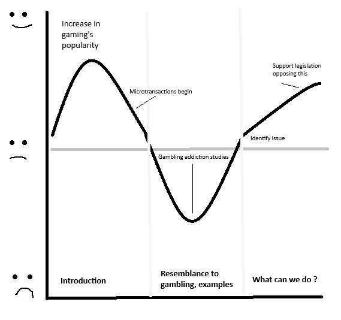

| [home page](https://h-calderon.github.io/portfolio/) | [visualizing government debt](visualizing-government-debt.md) | [critique by design](critique-by-design.md) | [final project part 1](final-project-part-1.md) | [final project part 2](final-project-part-2.md) | [final project part 3](final-project-part-3.md) |

# How this project came to be

## An initial outline
* Gambling mechanics are being normalized in videogames, most of which are accessible to minors
* As a reader, I’d like to identify where this is happening so I can protect myself. I can do this by learning where these addictive mechanics are being used and how to avoid them

 
## Part 1 - Gathering sources and initial drafts

During the first part, while I had a general idea of what I wanted to do, I wasn't certain if I could find the references required in order to show what I had in mind. Thus, the first step was gathering as many sources as possible, both qualitative research and quantitative research, which would include datasets that would allow me to create my own data visualizations.

Before I began reading through the sources, I had drafted a couple of sketches of what I'd like to show in the presentation, that could go along with the initial outline.

## Part 2 - Data Viz creation and Feedback

For the next part of the project, I started combing through the quantitative research and began putting together the datasets in a format that would allow me to create visualizations through Tableau. I'd say this was the hardest part, because there was a lot of information, and I had to decide what would be relevant to show and what would be overdoing it, not to mention that a lot of the research papers included a lot of statistical information that would only serve to confuse viewers.

Once the datasets were ready, I began playing around with Tableau to create the data viz. If you see part 1 and part 2 one next to the other, you can tell most of the initial sketches were actually replaced by other types of graphs, even if the general idea is still there. This is because I felt bar graphs and pie graphs would be the easiest way to convey the information and keep it understandable for first time viewers.

Once the Tableau storyboard was ready, I presented it to 3 test viewers to get their feedback. The most critical part of this was something I wouldn't have thought myself: viewers need simple definitions to get into the topic. Not everyone would know what a "loot box" is in the first place, and this was something I couldn't see myself because I'm too deep into this world of videogames to know this is not a commonly used term.

## Part 3 - Completing Shorthand

Based on the recommendations and feedback, I decided to switch presentation method altogether, going from Tableau only to Shorthand. This allowed me to include key definitions, some more of the qualitative research in the form of quotes and to better organize the story. It also changed the call to action a bit, which went from only asking for more legal regulations to showing people what they can do to protect themselves from this trend.

The structure of the presentation remained very similar to what the initial outline was, except this time it included more text. I also included quotes to show how this affected real people, what their motivations were, and the real crux of the issue: how their spending habits were becoming pretty similar to self-described problem gamblers.

All around, I'm pretty happy with the result. You can see it here: https://carnegiemellon.shorthandstories.com/pay-to-play/index.html 
