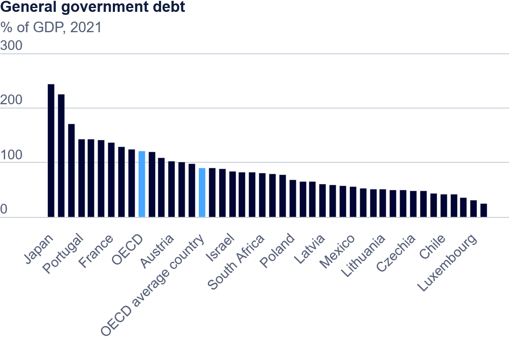

| [home page](https://h-calderon.github.io/portfolio/) | [visualizing government debt](visualizing-government-debt.md) |

# Visualizing Government Debt

## Bar Chart

> Source: <a href="https://www.oecd.org/en/data/indicators/general-government-debt.html?oecdcontrol-3122613a85-var3=2021">Organisation for Economic Co-operation and Development</a>

## Heat Map

<noscript></noscript><object class='tableauViz'  style='display:none;'><param name='host_url' value='https%3A%2F%2Fpublic.tableau.com%2F' /> <param name='embed_code_version' value='3' /> <param name='site_root' value='' /><param name='name' value='DebttoGDPRatio-Heatmap&#47;NationalDebttoGDPRatio' /><param name='tabs' value='no' /><param name='toolbar' value='yes' /><param name='static_image' value='https:&#47;&#47;public.tableau.com&#47;static&#47;images&#47;De&#47;DebttoGDPRatio-Heatmap&#47;NationalDebttoGDPRatio&#47;1.png' /> <param name='animate_transition' value='yes' /><param name='display_static_image' value='yes' /><param name='display_spinner' value='yes' /><param name='display_overlay' value='yes' /><param name='display_count' value='yes' /><param name='language' value='en-US' /></object>
                

## Lollipop Chart

<noscript></noscript><object class='tableauViz'  style='display:none;'><param name='host_url' value='https%3A%2F%2Fpublic.tableau.com%2F' /> <param name='embed_code_version' value='3' /> <param name='site_root' value='' /><param name='name' value='DebttoGDPRatio_17305743972470&#47;Top10CountrieswithhighestaverageDebttoGDPRatio' /><param name='tabs' value='no' /><param name='toolbar' value='yes' /><param name='static_image' value='https:&#47;&#47;public.tableau.com&#47;static&#47;images&#47;De&#47;DebttoGDPRatio_17305743972470&#47;Top10CountrieswithhighestaverageDebttoGDPRatio&#47;1.png' /> <param name='animate_transition' value='yes' /><param name='display_static_image' value='yes' /><param name='display_spinner' value='yes' /><param name='display_overlay' value='yes' /><param name='display_count' value='yes' /><param name='language' value='en-US' /></object>
                

